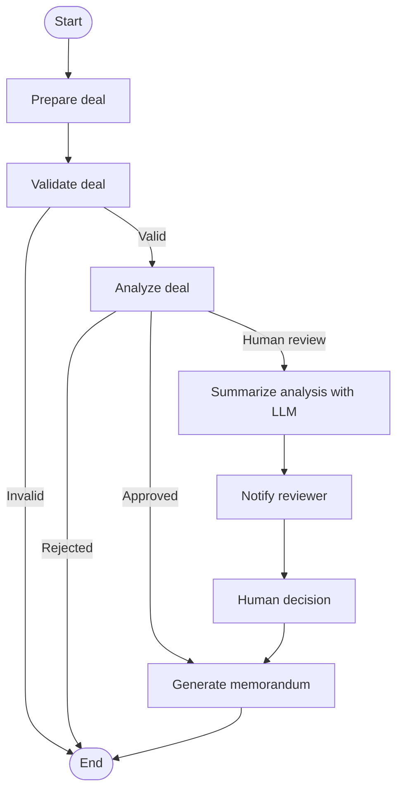
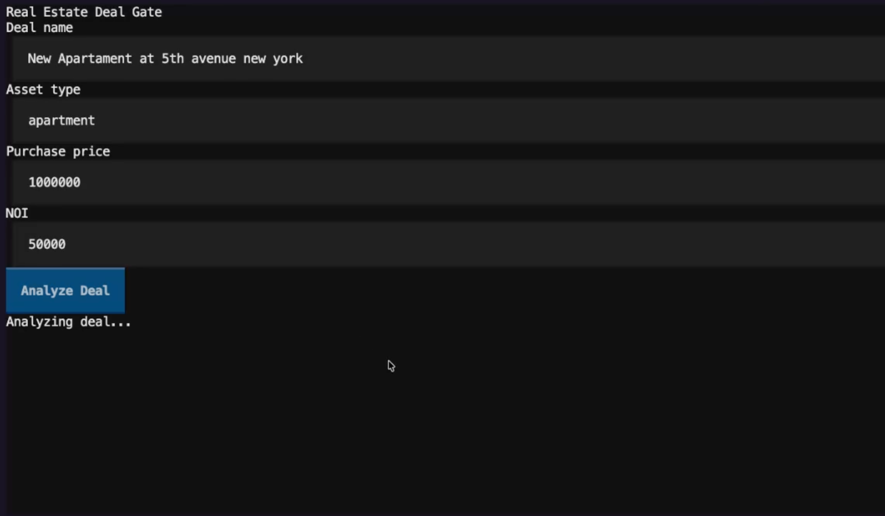
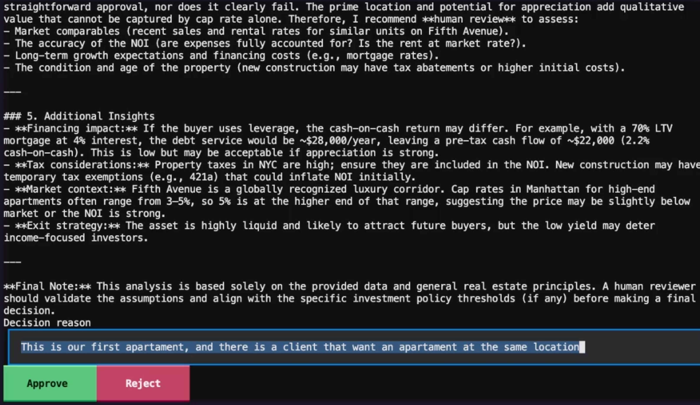
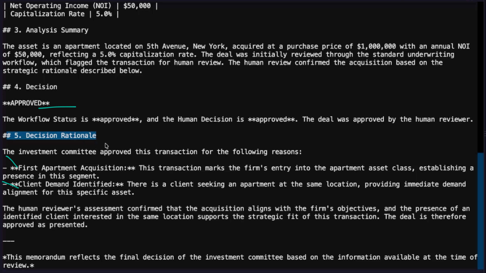

# Real Estate Deal Gate

This project explores **Human in the Loop (HITL)** workflows with LangGraph. The system receives real estate deal data, validates the information, and calculates the cap rate to determine whether the deal can be automatically approved or rejected.

When the result falls between the policy thresholds, the workflow is interrupted for human review. The reviewer receives an LLM-generated analysis, provides a decision and rationale, and the system then produces the final investment memorandum.

This project was also built as a **hands-on way to strengthen my Python skills** while learning AI Engineering concepts such as stateful workflows, routing, persistence, testing, and human-in-the-loop orchestration.

## LangGraph workflow

## Demonstration

### 1. Deal submission and analysis

### 2. Human review

### 3. Final memorandum

